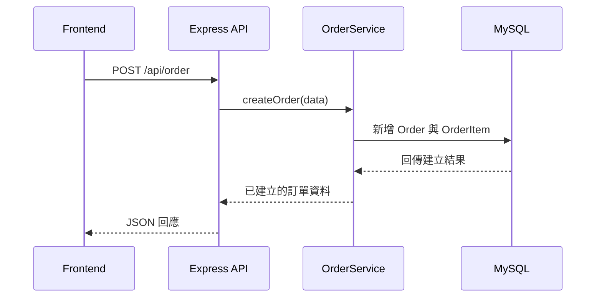

# 系統架構與資料流說明

本專案採用前後端分離的設計，整體流程如下：

## 架構概覽

- **Frontend**：使用 React 與 Vite 進行開發，程式碼位於 `client` 資料夾。
- **Backend**：以 Node.js 搭配 Express 建置 RESTful API，程式碼位於 `server` 資料夾。
- **Database**：透過 Sequelize 操作 MySQL，資料模型定義於 `server/models`。
- **啟動方式**：`node start.js` 會同時在開發模式下啟動前端與後端。

前端透過 Vite 的 proxy 設定，將對 `/api` 的請求轉發至後端服務，無須在程式中寫死後端網址。

## 資料流流程

1. **前端發送請求**
   - 以 `client/src/api/order.js` 為例，前端呼叫 `fetch('/api/order')` 送出訂單相關資料。
2. **Express Router**
   - 後端在 `server/routes` 中定義各式路由，例如 `orderRouter.js` 對應 `/api/order`。
3. **Controller 層**
   - Router 轉交請求至相應的 controller，例如 `OrderController.createOrder`。
   - Controller 負責解析請求資料並呼叫服務層處理商業邏輯。
4. **Service 層**
   - 服務層（如 `OrderService.placeOrder`）負責實際的資料處理流程，包括生成訂單編號、寫入資料庫等。
   - 服務層呼叫 Sequelize model，與 MySQL 資料庫互動。
5. **Model 與資料庫**
   - Sequelize models 定義於 `server/models`，包含 `Order`, `OrderItem`, `Product` 等。
   - 透過 `sequelize.sync()` 確保資料表與 model 一致，並執行 CRUD 操作。
6. **回傳結果**
   - 服務層將結果回傳給 controller，再由 controller 組成 JSON 回應送回前端。
   - 前端接收資料後更新畫面或進一步處理。

以下為一個下訂單流程的範例：

透過上述層次化設計，前端僅需透過簡潔的 fetch 呼叫，即可完成與資料庫的互動，而後端則清楚區分路由、控制器與服務邏輯，易於維護與擴充。
